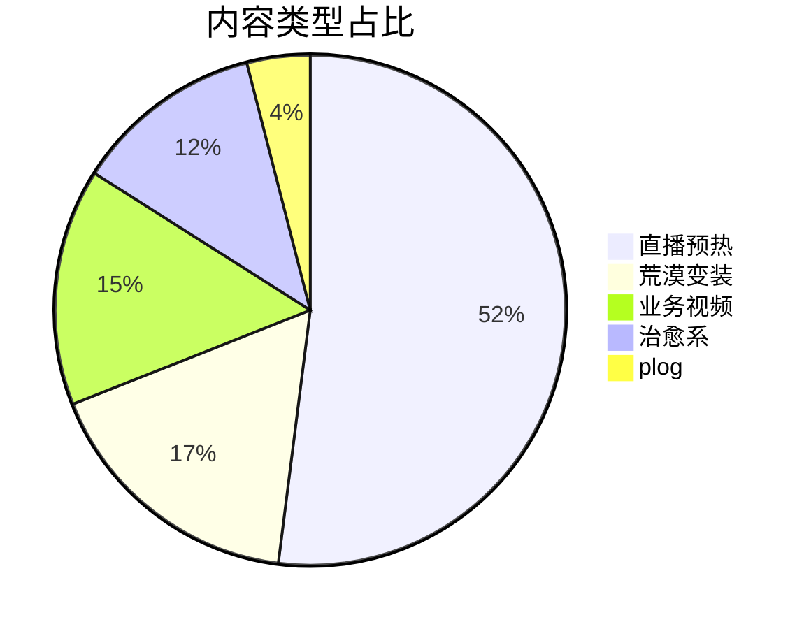

# 复盘报告视觉排版与图表可视化指南（2.0 版）

本指南基于《蚂蚁森林官抖 2-4 月季度复盘》等优秀钉钉文档的视觉风格，规范复盘报告在钉钉文档中的排版、配色与图表呈现方式，确保报告既有数据深度，又有视觉冲击力。

## 一、整体视觉风格

### 1.1 文档气质

- **清新、专业、有数据感**：主色使用绿色系，呼应正向增长、达成、环保/治愈等心智
- **信息密度高但不压抑**：通过卡片、引用块、表格、图片组合，降低长文本阅读压力
- **数据即视觉**：关键数字通过颜色、加粗、卡片独立呈现，一眼可抓取

### 1.2 结构节奏

每个大章节遵循以下视觉节奏：

```
大标题（## 一、KPI达成情况）
    ↓
2-3 句话整体概述
    ↓
数据总览列表 / 表格（核心 KPI 一览）
    ↓
分维度解读（带图片/截图）
    ↓
引用块总结洞察
    ↓
案例卡片（TOP 案例）
    ↓
--- 分隔线
```

## 二、色彩规范

### 2.1 主色与辅助色

| 用途 | 颜色值 | 使用场景 |
|------|--------|---------|
| **主色绿** | `#00B14D` | 正向数据、达成指标、关键结论、亮点强调 |
| **辅助灰** | `rgba(23, 26, 29, 0.4)` 或 `#A5A5A5` | 辅助说明、来源标注、时间/周期信息 |
| **强调黄** | `#FFF5B8` | 需要特别提醒的策略点、注意事项 |
| **深文本** | `#171A1D` 或 `#0F1115` | 问题点标题、重要正文 |
| **卡片背景绿** | `#ECF9F0` → `#D3ECE6` 渐变 | 要点卡片、数据卡片、案例结论 |
| **白色背景** | `#FFFEFE` | 卡片高光区域 |

### 2.2 使用原则

- **正向数据优先用绿**：播放量、涨粉、达成率、完播率提升等
- **问题/风险用深色或红**：问题点标题用深黑，必要时用红色 `#E03E3E`
- **不要滥用颜色**：每个段落不超过 2-3 种颜色，保持克制

## 三、核心排版元素

### 3.1 渐变卡片（数据卡片 / 要点卡片）

用于封装关键结论、案例数据、策略要点：

```html
<div style="background-color:linear-gradient(316deg, #ECF9F0 -13%, #FFFEFE 52%, #D3ECE6 125%)">
  <li>自然流播放超 134w</li>
  <li>5s 完播率 44.98%</li>
  <li>直接涨粉超 1.1w</li>
</div>
```

**适用场景**：
- TOP 视频数据卡片
- 投放案例结论
- 栏目定位说明
- 爆款归因总结
- 下阶段目标强调

### 3.2 引用块（::: 包裹）

用于段落式分析、洞察总结、Learning 提炼：

```markdown
:::
本季度周期内视频＋直播双渠道涨粉净增 6.49w，粉丝画像相对健康……

**但粉丝粘性欠佳**：直播涨粉留存率不高，存在日常涨粉掉粉的情况。
:::
```

**适用场景**：
- 粉丝画像解读
- 数据归因分析
- 策略调整说明
- 问题总结与改进方向
- 季度运营总结

### 3.3 彩色文字强调

通过 HTML `<span>` 标签实现颜色控制：

```markdown
- 本季度发布视频 <span style="color: #00B14D;">**52 条**</span>
- 总播放量超 <span style="color: #00B14D;">**671w**</span>
- <span style="color: #00B14D;">**季度涨粉 6.49w**</span>
```

**效果**：关键数字跳脱出来，读者可快速扫描。

### 3.4 标题层级与 emoji

- 一级标题 `#`：文档标题
- 二级标题 `##`：一、二、三、四、五、六 大章节
- 三级标题 `###`：（一）（二）（三）子章节
- 四级标题 `####`：具体维度/案例
- 五级标题 `#####`：更细分的案例/数据点

**TOP 案例标题**：使用奖牌 emoji `[奖牌]` + 粗体 + 书名号

```markdown
##### [奖牌]**TOP1《荒漠变装12.0-武家坡》**：
```

## 四、图表可视化原则（核心新增）

### 4.1 原则：能图表，不表格；能表格，不列表

用户提供的原始数据（如 Excel、后台截图）应尽量转化为可视化图表，提升阅读效率。

### 4.2 可生成的图表类型

| 数据类型 | 推荐图表 | 示例 |
|---------|---------|------|
| KPI 达成 vs 目标 | 进度条/环形图 | 播放量完成率 120% |
| 时间趋势 | 折线图 | 月度播放量走势 |
| 占比分布 | 饼图/环形图 | 内容类型占比（直播预热 52%、荒漠变装 17%） |
| 对比分析 | 柱状图 | 本期 vs 上期 vs 同行 |
| 完成状态 | 仪表盘 | 季度目标完成度 |
| 漏斗转化 | 漏斗图 | 曝光→点击→留资→订单 |
| 词云 | 词云图 | 评论区高频词、品牌关键词 |

### 4.3 图表生成方式

根据数据复杂度和场景，选择以下方式：

#### 方式 A：HTML + SVG 图表（推荐，钉钉可渲染）

生成内嵌 SVG 的 HTML 片段，导出为图片或直接作为图片插入：

```html
<!-- 示例：完成率进度条 -->
<div style="width:100%; background:#F0F0F0; border-radius:8px; height:20px;">
  <div style="width:120%; background:#00B14D; border-radius:8px; height:20px;"></div>
</div>
<p>目标：500w，实际：671w，达成率 134%</p>
```

#### 方式 B：使用 Python 绘图库生成图片

使用 matplotlib / plotly / pyecharts 生成 PNG/SVG，再上传到钉钉文档或 OSS：

```python
import matplotlib.pyplot as plt

# 示例：内容类型占比饼图
labels = ['直播预热', '荒漠变装', '业务视频', '治愈系', 'plog']
sizes = [52, 17, 15, 12, 4]
colors = ['#00B14D', '#66D69A', '#A5A5A5', '#D3ECE6', '#F0F0F0']

plt.figure(figsize=(8, 6))
plt.pie(sizes, labels=labels, autopct='%1.0f%%', colors=colors, startangle=90)
plt.title('Q1 内容类型发布占比')
plt.savefig('content_type_pie.png', dpi=150, bbox_inches='tight')
```

#### 方式 C：使用在线图表工具 / Mermaid

对于流程、时间线、矩阵等，使用 Mermaid 语法：

```markdown

```

> 注意：钉钉文档对 Mermaid 的支持有限，建议生成图片后插入。

### 4.4 图表设计规范

1. **配色统一**：使用本指南定义的绿色系为主色，避免彩虹色
2. **标注清晰**：每个图表必须有标题、单位、数据来源
3. **突出重点**：用颜色突出核心数据点，其余用灰色弱化
4. **控制数量**：每个大章节 1-3 个图表即可，避免堆砌
5. **图表与文字结合**：图表下方必须有 1-2 句解读，不要只放图

### 4.5 数据可视化优先级

在生成报告时，按以下优先级判断是否需要可视化：

```
1. 核心 KPI 达成情况 → 必须可视化（进度条/仪表盘）
2. 内容/栏目占比 → 必须可视化（饼图/环形图/柱状图）
3. 时间趋势 → 尽量可视化（折线图）
4. 对比分析 → 尽量可视化（柱状图/分组柱状图）
5. 用户画像 → 尽量可视化（饼图/柱状图）
6. 问题归因 → 可用表格或文字，复杂时可用矩阵图
```

## 五、图文排版组合

### 5.1 图片 + 文字卡片组合

案例展示的标准组合：

```markdown
##### [奖牌]**TOP1《荒漠变装12.0-武家坡》**：


<div style="background-color:linear-gradient(316deg, #ECF9F0 -13%, #FFFEFE 52%, #D3ECE6 125%)">
  <li>自然流播放超 134w</li>
  <li>5s 完播率 44.98%</li>
  <li>直接涨粉超 1.1w</li>
</div>


:::
**爆款归因**：顶流 BGM + 强反差视觉 + 蚂蚁森林公益 IP
**Learning**：强烈的画面反差让用户瞬间感受到治沙成果，易引发集体荣誉感与主动传播
:::
```

### 5.2 多图并列

同组截图可横向排列，用紧凑的图片引用：

```markdown

```

> 钉钉文档会自动处理多图布局，但建议同组图片尺寸相近。

### 5.3 截图 + 注释

后台数据截图下方紧跟来源标注：

```markdown

<span style="color: #44536B;">（来源：创作者中心）</span>
```

## 六、分场景排版示例

### 6.1 KPI 达成章节

```markdown
## 一、KPI达成情况

### （一）整体数据概览

本季度运营周期内，核心指标达成如下：

- 共制作并发布 <span style="color: #00B14D;">**视频 52 条**</span>
- 总播放量超 <span style="color: #00B14D;">**671w**</span>
- 总点赞量 <span style="color: #00B14D;">**51.86w**</span>
- <span style="color: #00B14D;">**季度涨粉 6.49w**</span>，计划 5 月底涨粉至 88.5w


| 核心指标 | 目标 | 实际 | 达成率 | 环比 |
|---------|------|------|--------|------|
| 播放量 | 500w | 671w | 134% | +23% |
| 涨粉 | 5w | 6.49w | 130% | +95% |
| 点赞 | 40w | 51.86w | 130% | +30% |
```

### 6.2 内容运营章节

```markdown
### （一）内容运营

季度内共制作并发布视频 52 条，直播预热占比超 50%，主力栏目仍是荒漠变装。


- <span style="color: #00B14D;">**【荒漠变装】**</span> 综合表现 top1，作为品牌官号传递种树心智的重要出口
- 【直播预热】综合表现 top2，本周期内互动率提高 3.64%
- 【业务视频】互动率、完播率均低于 25 年均值

##### [奖牌]**TOP1《荒漠变装12.0》**：


<div style="background-color:linear-gradient(316deg, #ECF9F0 -13%, #FFFEFE 52%, #D3ECE6 125%)">
  <li>自然流播放超 134w</li>
  <li>5s 完播率 44.98%</li>
  <li>直接涨粉超 1.1w</li>
</div>

:::
**爆款归因**：顶流 BGM + 强反差视觉 + 公益 IP
**Learning**：强反差画面 + 集体荣誉感 = 高传播
:::
```

### 6.3 问题与优化章节

```markdown
## 四、问题点及优化方向

:::
#### 执行问题总结
1. **信息未及时对齐**：前期策划与现场实际拍摄内容不符
2. **未准确预估风险项**：现场信号差、机动性差、车辆报备等问题
3. **人员分配不合理**：现场 4 人全部承担拍摄，未预留机动人员
:::

| 问题 | 归因分析 | 优化方向 |
|------|---------|---------|
| 信息未对齐 | 前期沟通不足，时间节点未框定 | 执行前主动获取排期，建立二次确认机制 |
| 风险预估不足 | 缺乏现场经验，未准备 Plan B | 提前踩点，建立风险清单和应急预案 |
```

## 七、钉钉文档特殊注意事项

### 7.1 图片引用

钉钉文档支持 Markdown 图片引用，但图片需可公网访问或上传至钉钉：

```markdown

```

### 7.2 HTML 样式

钉钉文档对部分 HTML 样式支持有限，优先使用：
- `<div style="background-color:linear-gradient(...)">` 渐变卡片
- `<span style="color: #00B14D;">` 彩色文字
- `<li>` 列表项

避免使用复杂的 CSS 布局。

### 7.3 长文档分批写入

当报告包含大量图片和图表时，单次 `dws doc create` 可能超时，按以下策略分批：

1. 第一批：标题 + 元信息 + KPI 达成情况（含图表）
2. 第二批：核心运营解读（含图片、案例卡片）
3. 第三批：策略调整 + 问题优化 + 下阶段规划 + 总结

## 八、检查清单

生成报告后，对照以下清单检查视觉效果：

- [ ] 核心 KPI 是否有可视化图表（进度条/仪表盘/柱状图）
- [ ] 关键正向数据是否用绿色 `#00B14D` 加粗标注
- [ ] 是否有 1-2 个 TOP 案例卡片（图片 + 数据 + 归因 + Learning）
- [ ] 大章节之间是否用 `---` 分隔线
- [ ] 分析性段落是否用 `:::` 引用块包裹
- [ ] 问题点是否有明确的归因和优化方向
- [ ] 图片是否有来源标注或说明文字
- [ ] 下阶段规划是否有表格（时间/内容/目标/负责人）
- [ ] 整体配色是否控制在绿/灰/白/黄四色以内
- [ ] emoji 使用是否适度，没有过度堆砌
